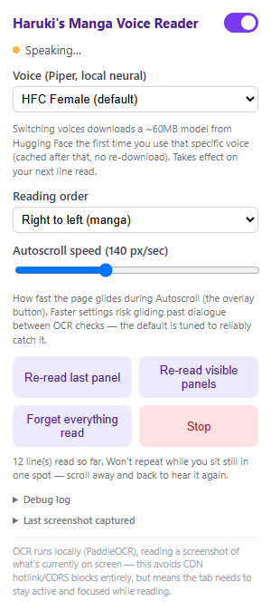

# Haruki's Manga Voice Reader

A Chrome extension that reads manga and comic panels aloud as you browse — no
pre-processed audiobooks, no site cooperation required. It watches what's on
screen, recognizes the text in each panel with on-page OCR, and speaks it
with a realistic local text-to-speech voice.

## Capabilities

- **On-page OCR** — recognizes dialogue directly from screenshots of what's
  visible, using PaddleOCR with a comic-text-detector rescue pass for
  panels with unusual bubble layouts or dense art.
- **Local neural TTS** — reads lines aloud with Piper, entirely on-device;
  multiple voices to choose from in the popup.
- **Reads only the manga** — automatically ignores site chrome, ads, and
  synopsis/info-page text; only recognizes text that actually overlaps a
  manga image on the page.
- **Read selected text** — highlight any text (e.g. a synopsis) and press
  Read to have it spoken directly, no OCR involved.
- **Autoscroll** — glides down the page for you, pausing while each panel is
  read, so you can go hands-free.
- **Never repeats** — tracks what's already been read; scrolling back over a
  panel won't re-trigger it unless you ask it to.
- **Reading order** — right-to-left (manga) or left-to-right (comics/webtoons).
- **Always-visible overlay** — quick Read / Autoscroll / Pause controls on
  the page itself, no need to open the popup.

## Settings

- **Toggle (top-right)** — turns the extension on/off for the current site.
- **Voice** — picks the Piper neural TTS voice used for reading.
- **Reading order** — right-to-left for manga, left-to-right for
  comics/webtoons; controls which panel/bubble gets read first.
- **Autoscroll speed** — how fast the page glides during Autoscroll.
- **Re-read last panel / Re-read visible panels** — manually re-trigger OCR
  without waiting for a scroll to retrigger it.
- **Forget everything read** — clears the "already read" history so panels
  you've scrolled past will be read again.
- **Stop** — stops reading entirely for this tab.
- **Debug log / Last screenshot captured** — expandable panels for
  troubleshooting what the OCR pipeline actually saw.

## Overlay controls

A small always-visible bar appears on the page itself so you don't need to
open the popup:

- **Status dot + text** — shows idle / reading / speaking / error at a glance.
- **Read** — OCRs and reads the panels currently visible right now (or, if
  you've highlighted text on the page, reads that selection directly instead
  of OCR'ing anything).
- **Autoscroll** — glides the page down for you, pausing while each panel is
  read; click again (**Stop Scroll**) to stop.
- **Pause** — pauses reading in place; refresh the page to resume normally.

## Installing (unpacked, for development/testing)

1. Open `chrome://extensions`
2. Enable **Developer mode**
3. Click **Load unpacked** and select this repo's root folder

## License

GPL-3.0 — see [LICENSE](LICENSE).
